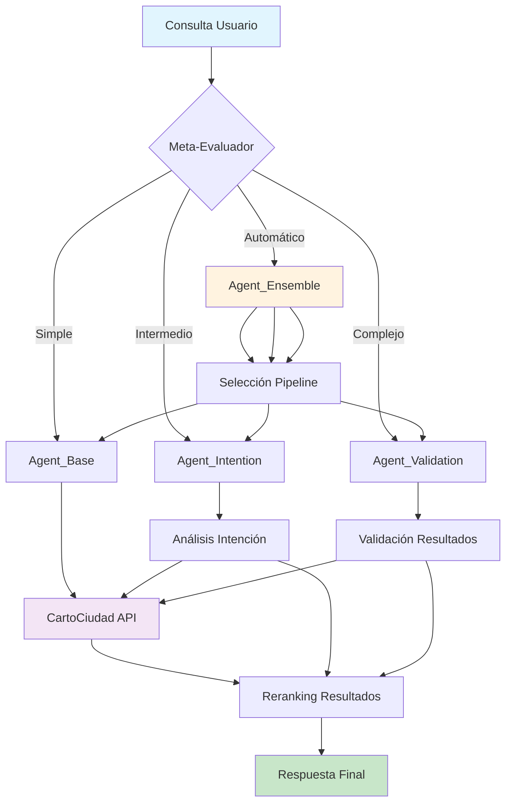

<div align="center">
  
  <!-- Logo del proyecto -->
  
  
  # 🚀 PyCiudad Agents
  
  [](https://www.python.org/downloads/)
  [](https://langchain.dev/)
  [](https://langchain-ai.github.io/langgraph/)
  [](https://opensource.org/licenses/MIT)
  [](#)
  
</div>

> **Arquitectura modular avanzada para agentes inteligentes especializados en geolocalización**  
> Framework completo con sistema de evaluación, análisis de rendimiento y generación de datasets

---

## 📋 Índice

- [🎯 Descripción del Proyecto](#-descripción-del-proyecto)
- [🏗️ Arquitectura del Sistema](#️-arquitectura-del-sistema)
- [📦 Estructura del Proyecto](#-estructura-del-proyecto)
- [⚙️ Instalación y Configuración](#️-instalación-y-configuración)
- [🧑‍💻 Uso del Sistema](#-uso-del-sistema)
- [🔬 Evaluación y Análisis](#-evaluación-y-análisis)
- [📊 Generación de Datasets](#-generación-de-datasets)
- [🛠️ Scripts Utilitarios](#️-scripts-utilitarios)
- [📈 Visualización y Métricas](#-visualización-y-métricas)
- [📄 Licencia](#-licencia)

---

## 🎯 Descripción del Proyecto

**PyCiudad Agents** es un framework modular desarrollado como proyecto demostrativo de TFG que implementa una arquitectura avanzada de agentes inteligentes especializados en tareas de geolocalización. El sistema utiliza **LangChain** y **LangGraph** para crear pipelines de procesamiento de consultas geográficas con diferentes niveles de complejidad.

### 🌟 Características Principales

- **🤖 4 Tipos de Agentes Especializados:** Base, Intención, Validación y Ensemble
- **📊 Sistema de Evaluación Completo:** Métricas automáticas y análisis de rendimiento
- **🎨 Visualización Avanzada:** Generación automática de gráficos y análisis comparativo
- **🔄 Generación de Datasets:** Herramientas para crear datasets de entrenamiento sintéticos
- **⚡ Soporte Multi-Modelo:** Compatible con Ollama (local) y APIs externas
- **📈 Análisis de Eficiencia:** Trade-off entre calidad y velocidad de respuesta

### 🎯 Casos de Uso

- **Búsqueda Geográfica Inteligente:** Procesamiento de consultas en lenguaje natural
- **Análisis de Intención:** Detección automática del tipo de ubicación buscada  
- **Validación de Resultados:** Verificación automática de calidad de respuestas
- **Optimización de Pipelines:** Selección automática del agente más apropiado

---

## 🏗️ Arquitectura del Sistema



### 🔄 Flujo de Procesamiento

1. **📥 Entrada:** Consulta en lenguaje natural del usuario
2. **🧠 Análisis:** El Meta-Evaluador determina la complejidad
3. **🎯 Selección:** Se elige el agente más apropiado
4. **🔍 Procesamiento:** Extracción de entidades y normalización
5. **🌐 Búsqueda:** Consulta a la API de CartoCiudad
6. **📊 Ranking:** Reordenamiento por relevancia
7. **✅ Validación:** Verificación de calidad (opcional)
8. **📤 Salida:** Resultados ordenados y validados

---

## 📦 Estructura del Proyecto

```
PyCiudad_Agents/
├── 🎨 assets/                    # Recursos visuales y branding
│   └── images/                  # Logos, diagramas, capturas
├── 🤖 agents/                    # Implementación de agentes
│   ├── Agent_base/              # Agente base (pipeline simple)
│   ├── Agent_intention/         # Agente con análisis de intención
│   ├── Agent_validation/        # Agente con validación de resultados
│   ├── Agent_ensemble/          # Meta-agente selector de pipelines
│   └── common/                  # Utilidades compartidas
│       ├── llm_config.py       # Configuración de modelos LLM
│       ├── schemas.py          # Esquemas Pydantic
│       ├── tools.py            # Herramientas (CartoCiudad API)
│       └── utils.py            # Funciones utilitarias
├── 📊 data/                     # Gestión de datos
│   ├── Agent_dataset_generator/ # Generador de datasets sintéticos
│   ├── constantes.py           # Constantes geográficas
│   └── datasets/               # Datasets generados
├── 🔬 evaluation/               # Sistema de evaluación
│   ├── core/                   # Motor de evaluación
│   ├── configs/                # Configuraciones de modelos
│   ├── scripts/                # Scripts de ejecución
│   ├── utils/                  # Utilidades de análisis
│   └── results/                # Resultados de evaluaciones
├── 📈 plots/                    # Análisis visual
│   ├── comparisons/            # Gráficos comparativos
│   ├── agent_*/                # Análisis por agente
│   └── generate_analysis_plots.py
├── 🛠️ scripts/                  # Herramientas auxiliares
│   ├── data/                   # Scripts de datasets
│   ├── cleanup_redundant_files.py
│   └── verify_dependencies.py
├── 💡 examples/                 # Ejemplos de uso
└── 📄 docs/                     # Documentación
```

---

## ⚙️ Instalación y Configuración

### 📋 Requisitos Previos

- **Python 3.11+** (recomendado 3.11)
- **Git** para clonar el repositorio
- **Conda** o **venv** para gestión de entornos
- **Ollama** (opcional, para modelos locales)

### 🚀 Instalación Rápida

```bash
# 1. Clonar el repositorio
git clone https://github.com/tu_usuario/PyCiudad_Agents.git
cd PyCiudad_Agents

# 2. Crear entorno virtual
conda create -n pyciudad-agents python=3.11 -y
conda activate pyciudad-agents

# 3. Instalar dependencias
pip install -r requirements.txt

# 4. Verificar instalación
python scripts/verify_dependencies.py
```

### 🔧 Configuración de Modelos

#### Modelos Locales (Ollama)
```bash
# Instalar Ollama
curl -fsSL https://ollama.ai/install.sh | sh

# Descargar modelos recomendados
ollama pull qwen3:30b-a3b      # Modelo principal
ollama pull qwq:latest         # Modelo con capacidades de reasoning

# Configurar variables de entorno
export OLLAMA_MODEL="qwen3:30b-a3b"
export OLLAMA_MODEL_THINKING="qwq:latest"
export OLLAMA_HOST_PORT="http://localhost:11434"
```

#### APIs Externas (Opcional)
```bash
# OpenAI
export OPENAI_API_KEY="tu-api-key"
export OPENAI_MODEL_NAME="gpt-4"

# Anthropic Claude
export ANTHROPIC_API_KEY="tu-api-key"
export ANTHROPIC_MODEL_NAME="claude-3-sonnet"
```

---

## 🧑‍💻 Uso del Sistema

### 🎯 Ejecución Directa de Agentes

```bash
# Agente Base (pipeline simple)
python examples/run_agente_base.py "Calle Mayor Madrid"

# Agente con Análisis de Intención
python examples/run_agente_intention.py "donde está el KIO en Madrid"

# Agente con Validación
python examples/run_agente_validation.py "plaza españa sevilla"

# Meta-Agente Ensemble (selección automática)
python examples/run_agente_ensemble.py "cómo llego a la plaza mayor"
```

### 🔄 Uso Programático

```python
from agents.Agent_base.agent_base import app_base
from agents.Agent_ensemble.agent_ensemble import app_ensemble

# Usar agente base
result_base = app_base.invoke({
    "user_query": "Atocha Madrid"
})

# Usar meta-agente (recomendado)
result_ensemble = app_ensemble.invoke({
    "user_query": "donde está el museo del prado"
})

print("Resultados:", result_ensemble["final_candidates"])
```

### 🌐 Servicio LangGraph

```bash
# Levantar servicio de desarrollo
langgraph dev

# El servicio estará disponible en:
# http://localhost:2024
```

---

## 🔬 Evaluación y Análisis

El sistema incluye un framework completo de evaluación para analizar el rendimiento de los diferentes agentes.

### 📊 Ejecutar Evaluación

```bash
# Evaluación rápida (50 samples)
python evaluation/scripts/run_evaluation.py --samples 50 --concurrent 2

# Evaluación completa del dataset
python evaluation/scripts/run_evaluation.py --full-dataset

# Solo análisis de resultados existentes
python evaluation/scripts/run_evaluation.py --analyze-only
```

### 📈 Métricas Principales

- **Combined Success Rate:** % de consultas resueltas exitosamente
- **Perfect Rate:** % de respuestas perfectas (posición 1)
- **Top-3/Top-5 Rate:** % de respuestas relevantes en primeras posiciones
- **Average Quality Score:** Puntuación promedio de calidad (0-1)
- **Execution Time:** Tiempo promedio de procesamiento
- **Thinking vs Regular:** Comparación de modelos con/sin reasoning

### 🔍 Análisis Comparativo

```bash
# Analizar resultados más recientes
python evaluation/scripts/analyze_results.py

# Comparación comprehensiva entre configuraciones
python evaluation/scripts/compare_model_configs.py --comprehensive
```

---

## 📊 Generación de Datasets

### 🎯 Dataset Inicial (Ground Truth)

```bash
# Generar dataset base desde CartoCiudad
python scripts/data/generar_dataset_direcciones.py
```

### 🔄 Datasets de Entrenamiento

```bash
# Generar variaciones sintéticas (50 direcciones)
python scripts/data/run_dataset_generator.py --sample-size 50

# Procesar todo el dataset
python scripts/data/run_dataset_generator.py --all

# Personalizar archivo de salida
python scripts/data/run_dataset_generator.py --output mi_dataset.json
```

### 📋 Características de los Datasets

- **Variaciones Lingüísticas:** Natural, coloquial, formal, preguntas
- **Niveles de Dificultad:** Fácil, medio, alto
- **Errores Sintéticos:** Ortográficos, abreviaciones, espaciado
- **Estadísticas Detalladas:** Distribución por tipo y dificultad

---

## 🛠️ Scripts Utilitarios

### 🗑️ Limpieza del Sistema

```bash
# Ver qué archivos se eliminarían
python scripts/cleanup_redundant_files.py --dry-run

# Ejecutar limpieza real
python scripts/cleanup_redundant_files.py
```

### ✅ Verificación de Dependencias

```bash
# Verificar todas las dependencias
python scripts/verify_dependencies.py
```

---

## 📈 Visualización y Métricas

### 🎨 Generación de Gráficos

```bash
# Analizar archivo específico
python plots/generate_analysis_plots.py results_local_1500samples.json

# Auto-detectar archivo más reciente
python plots/generate_analysis_plots.py
```

### 📊 Tipos de Visualizaciones

- **Comparación Principal:** Métricas clave entre agentes
- **Thinking vs Regular:** Impacto de modelos de reasoning
- **Quality-Speed Tradeoff:** Relación calidad vs velocidad
- **Distribución de Calidad:** Consistencia por agente
- **Heatmap de Rendimiento:** Vista matricial de métricas

### 📂 Outputs Generados

```
plots/
├── comparisons/              # 🎯 Gráficos principales para presentación
│   ├── 01_main_metrics_comparison.png
│   ├── 02_thinking_vs_regular_analysis.png
│   ├── 03_quality_speed_tradeoff.png
│   └── ...
├── agent_*/                  # Análisis individuales por agente
└── EXECUTIVE_SUMMARY.txt     # 📋 Reporte ejecutivo con insights
```

---

## 🔧 Configuración Avanzada

### 🎛️ Variables de Entorno

```bash
# Modelos Ollama
export OLLAMA_MODEL="qwen3:30b-a3b"
export OLLAMA_MODEL_THINKING="qwq:latest"
export OLLAMA_HOST_PORT="http://localhost:11434"

# Timeouts y configuración
export REQUEST_TIMEOUT=120
export MAX_RETRIES=3
```

### 📁 Estructura de Configuración

```
evaluation/configs/
├── model_pricing.json        # Precios de modelos
├── config_loader.py         # Cargador de configuraciones
└── update_model_config.py   # Actualizador de configuraciones
```

### 📋 Guías de Contribución

- Seguir el estilo de código existente
- Añadir tests para nuevas funcionalidades
- Actualizar documentación relevante
- Verificar que `python scripts/verify_dependencies.py` pasa

---

## 📚 Documentación Adicional

- **[Sistema de Evaluación](evaluation/README.md)** - Guía completa del framework de evaluación
- **[Generación de Datasets](data/Agent_dataset_generator/README.md)** - Documentación del generador
- **[Análisis Visual](plots/README.md)** - Guía de visualizaciones y métricas
- **[Scripts Utilitarios](scripts/README.md)** - Documentación de herramientas auxiliares

---

## 📄 Licencia

Este proyecto está bajo la **Licencia MIT** - ver el archivo [LICENSE](LICENSE) para más detalles.

---

## 👨‍🎓 Información del TFG

**Proyecto:** Superando la Rigidez de la Búsqueda Geoespacial - Agentes LLM como Interfaz Inteligente para CartoCiudad  
**Framework:** LangChain + LangGraph + Python  
**Características:** Sistema completo con evaluación, análisis y visualización  
**Propósito:** Demostración de capacidades avanzadas de agentes LLM

---

<div align="center">

**🚀 PyCiudad Agents - Construyendo el futuro de la geolocalización inteligente**

[](https://github.com/tu_usuario/PyCiudad_Agents)

</div>

---
